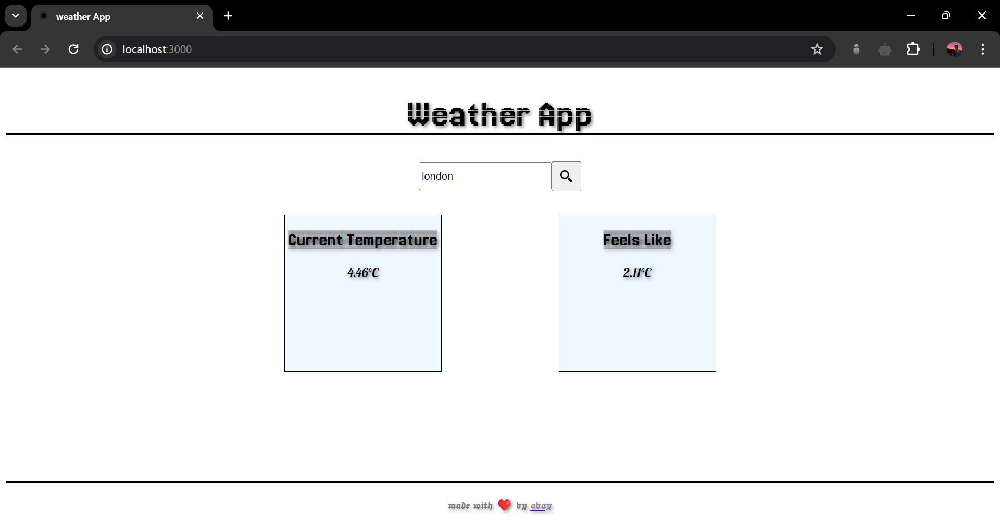

  
  

# React Weather App

A simple weather app built with React to fetch and display current weather data using the OpenWeatherMap API.

## Features

- **User-Friendly Interface:** Easily input a city name and get the current weather instantly.
- **Real-Time Data:** Fetches and displays the latest weather information from OpenWeatherMap API.
- **Responsive Design:** Works seamlessly across different devices and screen sizes.

## Technologies Used

- **React:** JavaScript library for building user interfaces.
- **OpenWeatherMap API:** Provides current weather data for any location.
- **HTML/CSS:** Basic styling and structure.

## Getting Started

1. Clone the repository: `git clone https://github.com/your-username/react-weather-app.git`
2. Navigate to the project directory: `cd react-weather-app`
3. Install dependencies: `npm install`
4. Obtain an API key from [OpenWeatherMap](https://openweathermap.org/api) and replace `'YOUR_API_KEY'` in `src/Body.js` with your API key.
5. Start the development server: `npm start`
6. Open [http://localhost:3000](http://localhost:3000) in your browser to view the app.

## License

This project is licensed under the MIT License. See the [LICENSE](LICENSE) file for details.

